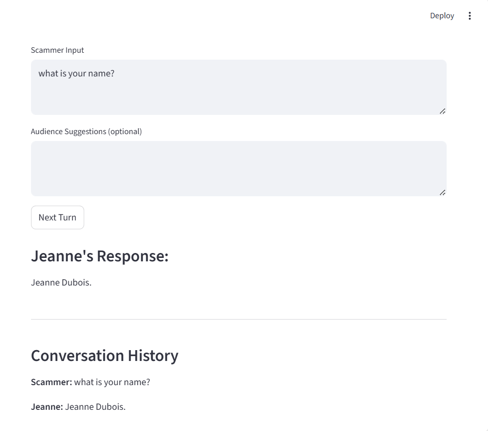

# Dynamic Scam Simulator - Master 2 AI Project

**Author:** Omomene IWELOMEN  
**Project-type** Solo  
**School:** IPSSI, Lyon  
**Course:** Master 2 Dev, Data, Artificial Intelligence     
**Tutor:** Antoine GREA    
**Project:** Dynamic Scam Simulator / "Projet Arnaque"


---

## 1. Project Overview

This project simulates a **dynamic, interactive scam scenario** using multiple LLM agents orchestrated with **LangChain**. The main purpose is to demonstrate multi-agent coordination, prompt engineering, memory handling, and audience interaction.

**Key features:**
- Multi-agent LLM setup: **Victim (Jeanne Dubois)**, **Director**, and **Moderator**
- Dynamic scam simulation following scripted flows (e.g., Tech Support, Bank Fraud)
- Audience influence: spectators can propose events that modify the victim’s behavior
- Audio feedback: Jeanne responds with realistic sound cues (dog barking, coughing, doorbell, TV background)
- Fully interactive **Streamlit UI** for demonstration

---

## 2. Folder Structure

```text
projet_arnaque/
│
├── README.md                  # This file
├── .gitignore                 # Ignore .env, __pycache__, audio files
├── .env                       # Local settings / API keys
├── requirements.txt           # Dependencies: langchain, gpt4all, streamlit, pydub
│
├── main.py                    # Streamlit UI + main simulation loop
├── app/
│   ├── agents.py              # LLM agents: Victim, Director, Moderator
│   ├── config.py              # Modular prompts
│   ├── tools.py               # Audio and MCP tools
│   └── utils.py               # Memory handling, audience winner selection, audio playback
│
├── data/
│   └── scam_scripts.json      # Scripted flows (Tech Support, Bank Fraud)
│
└── audio/
    ├── dog_bark.mp3
    ├── doorbell.mp3
    ├── coughing.mp3
    └── tv_background.mp3
````

---

## 3. Installation and Setup

1. Clone the repository:

```bash
git clone <your-repo-url>
cd projet_arnaque
```

2. Create and activate a virtual environment:

```bash
python -m venv venv
# Windows
venv\Scripts\activate
# Mac/Linux
source venv/bin/activate
```

3. Install dependencies:

```bash
pip install -r requirements.txt
```

4. Ensure your GPT4All model is in:

```text
./models/gpt4all-falcon-newbpe-q4_0.gguf
```

5. Make sure `.env` exists (even if empty) and is ignored by Git.

---

## 4. Running the Streamlit Demo

Launch the interactive simulator:

```bash
streamlit run main.py
```

**UI Overview:**

* **Scammer input:** Type what the scammer says to Jeanne
* **Audience suggestions:** Optional events that modify Jeanne’s behavior
* **Next Turn button:** Executes the next interaction
* **Output:** Jeanne responds in-character with optional sound effects


---

## 5. Usage Examples

**Scammer input:**

```
Hello madame, I am calling from Microsoft Support. Your PC is infected. Can you give me access?
```

**Audience suggestions:**

```
Dog barks, Doorbell rings, TV is loud
```

**Result:** Jeanne responds naturally in-character, possibly triggered by audience events:

```
"Oh dear, mon dieu… I don’t quite know where to click. Pardon me while Poupoune barks at the door."
```

Audio cues play automatically for realism.





---

## 6. Technical Implementation

**Agents:**

* **Victim (Jeanne Dubois):** Executes persona, responds with context + audience constraints, accesses audio tools
* **Director:** Monitors conversation, updates hidden objectives for the victim
* **Moderator:** Filters and selects audience suggestions

**LangChain Components:**

* **PromptTemplate:** Modular prompts for Victim, Director, and Moderator
* **LLMChain:** Each agent is implemented as a chain
* **ConversationBufferMemory:** Stores chat history to provide context for the victim

**Tools:**

* Audio playback functions decorated for LangChain tools (`dog_bark`, `doorbell`, `coughing`, `tv_background`)

---

## 7. Rationale

* Demonstrates multi-agent orchestration with LLMs
* Shows interactive storytelling with dynamic audience influence
* Integrates audio feedback for immersive experience
* Provides a clean, modular codebase with reusable agents, prompts, and tools

---

## 8. Notes

* No API keys are required; model runs locally with GPT4All `.gguf`
* Fully solo project
* All Python dependencies are included in `requirements.txt`
* `.gitignore` ensures sensitive files are not committed

---

## 9. Optional Extensions

* Implement voting logic for audience suggestions instead of automatic selection
* Add more scripted flows in `data/scam_scripts.json`
* Use multiple GPT4All models with different personas
* Extend audio tools for more interactive sound effects

---


## 10. References

* GPT4All Project - https://gpt4all.io/index.html?ref=localhost
* LangChain Documentation -https://docs.langchain.com/
* Streamlit Documentation - https://docs.streamlit.io/


